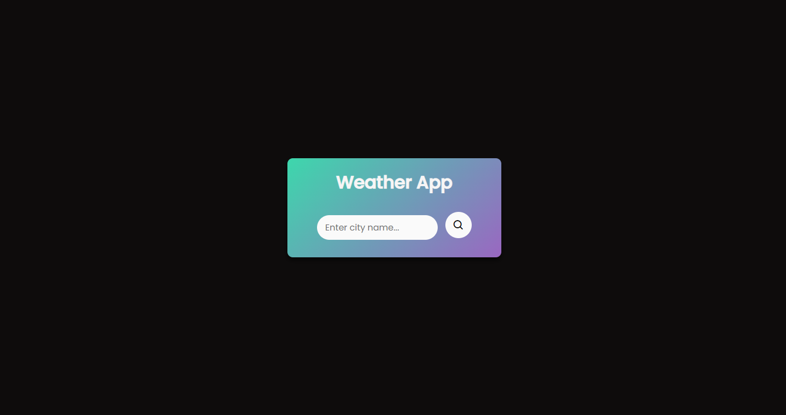

# 🌦️ Weather App

A simple weather web app built using **HTML**, **CSS**, and **JavaScript**. It shows the current weather based on your location or a searched city.

## 📸 Screenshot



## 🔗 Live Demo

[View the app here](https://your-vercel-domain.vercel.app)

## 🚀 Features

- Real-time weather updates
- Location and city-based forecast
- Clean and responsive UI

## 🛠️ Tech Stack

- HTML
- CSS
- JavaScript
- [OpenWeatherMap API](https://openweathermap.org/api)

## 📂 How to Run

```bash
# Clone the repository
git clone https://github.com/yourusername/weather-app.git

# Open index.html in your browser
```
